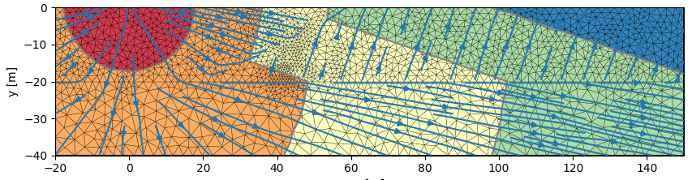
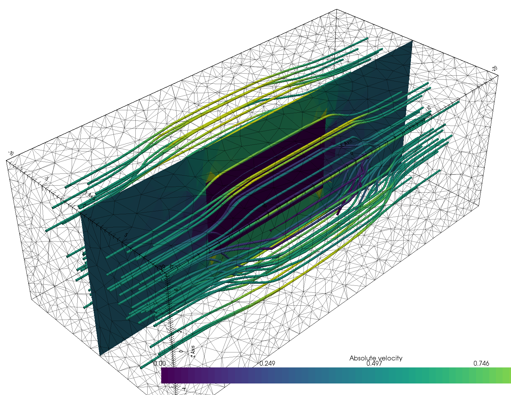
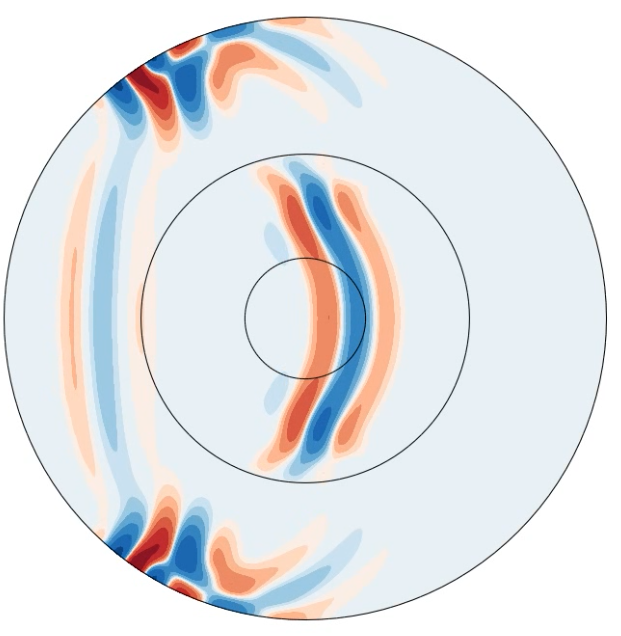
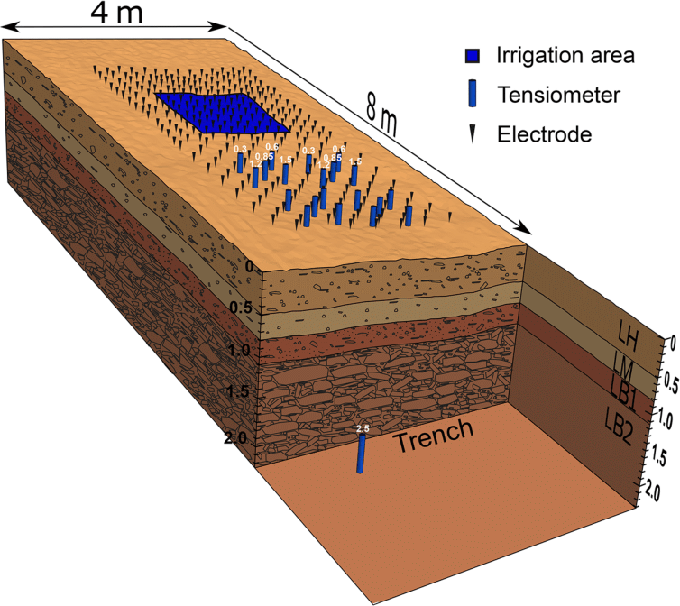
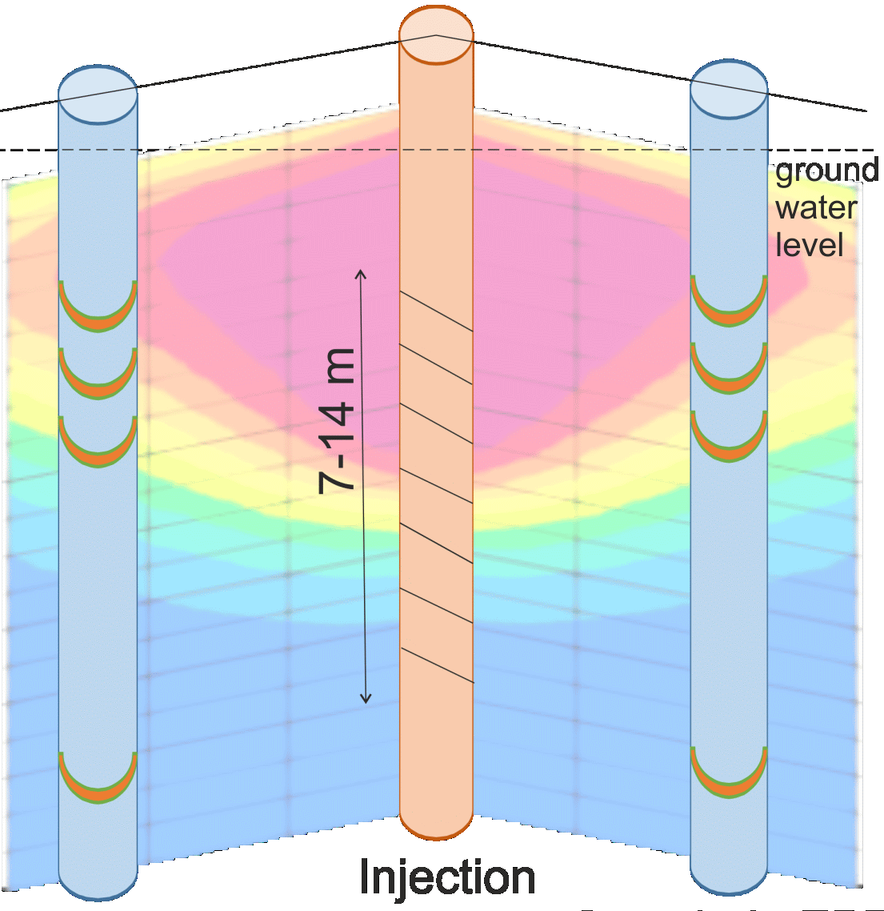

##  py**GIMLi** is a versatile open-source toolbox with:
::: {.columns}
::: {.column width="65%" .noincremental}
- management tools for **structured and unstructured meshes** in 2D & 3D
- computationally efficient **finite-element and finite-volume solvers**
- **various geophysical forward operators**: ERT/IP, Traveltime, Gravimetry, Magnetics, SP, EM
- frameworks for **constrained, joint and
process-based inversions** with **region-specific regularization**
- **open-source, platform compatible**, documented & tested code
- suitability for **teaching & reproducible research**
- 1.0 version published in 2017 in *Computers and Geosciences* [@Ruecker2017] [(and among the *Most Downloaded* papers since, > 430 citations, > 120 uses in peer-reviewed papers)]{.muted}
:::
::: {.column width="30%"}
::: {.r-stack}


{width="85%"}
:::
:::
:::

# pyGIMLi 

aims at making:

- easy things easy
- hard things possible
- everything transparent and reproducible

##  Existing tutorials

::: {.columns}
::: {.column .noincremental width="55%"}
- [Transform 2021](http://transform21.pygimli.org): creating **geometries & meshes**, **modeling** PDEs, **synthetic data**, **inversion** (also with **external forward operator**).
- [Transform 2022](http://transform22.pygimli.org):  fundamental `pyGIMLi` objects (`Mesh`, `DataContainer`, matrix types, etc.), **geostatistical** vs. smoothness regularization, treatment of subsurface **regions**, adding **prior data**.
- [SEG webinar 2024](http://seg24.pygimli.org): invert **real-life 3D data** [@Huebner2017] to tweak your **inversion beyond the standard** practice. 
- **Today** we practise & focus on ERT monitoring data processing & inversion.
:::
::: {.column width="45%"}
{width=90%}
:::
:::

##  What is new since?

::: {.noincremental}
- Transform '21 & '22 notebooks available as **tutorials** or **examples** on [pygimli.org](https://pygimli.org)
- **Improved 3D visualization** powered by [pyvista](https://pyvista.org) (filters, slices, interactivity)
- **3D gravity and (full-tensor) magnetics** operators and managers
- **New matrices and matrix generators**, e.g. non-explicit (PDE-based) Jacobian matrix
- `LSQRinversion` framework to include parameter relations [from @Wagner2019]
- `MultiFrameModelling` framework for temporally/spectrally/spatially constraints
- `TimelapseERT` class with different strategies, e.g. **4D inversion**
- **New examples** on ERT (2D/3D crosshole, 3D surface, timelapse), IP, 3D magnetics
- **Improved website**, i.e. fully upgraded to modern (pg>1.2) style and moved to the [*pydata-sphinx-theme*](https://pydata-sphinx-theme.readthedocs.io/en/stable/)
- Many **more convenience functions** to simplify the code
- Many **new papers using pyGIMLi** (<https://pygimli.org/publist.html>)
:::

##  New since v1.5.0 (SEG webinar)

https://github.com/gimli-org/gimli/releases

- enabled `pip install pygimli` for easier installation (e.g. on Google Colab)
- new **examples** (e.g. reciprocals) and improved old ones
- better access to **Jacobian, resolution matrices** etc.
- **syntactic sugar** (`data.show('i')`, `mesh.show('res')`, `data.estimateError()`)
- new **mesh functions**:<br> e.g., `submesh()`, `extract2dUpperSurfaceMesh()`, `extract2dSlice()` 
- new **matrix types**, e.g. for BFGS-based inversion
- different **inversion frameworks** (SD, NLCG, GN, L_BFGS, BFGS)
- fully **complex-valued** (FD) ERT-IP inversion (also for TD)
- improvements in **gravity, magnetics and TDEM**
- a lot of of bug fixes and improved docstrings

##  Join the pyGIMLi user community!

::: {.columns}
::: {.column width="60%"}


> "In open source, we feel strongly that to really **do something well**, you have to get a lot of people involved."
>
> *– Linus Torvalds*
:::

::: {.column width="40%" .noincremental}
1. **Join the `#pyGIMLi` chat** on [Mattermost](https://softwareunderground.org/mattermost)!
2. **Open a discussion** or **raise an issue** [on  GitHub](https://github.com/gimli-org/gimli).
3. **Contribute to the website** via the "Improve this page" button in the right sidebar.
4. **Add your** pyGIMLi-powered **publication** to [this database](https://github.com/gimli-org/gimli/blob/dev/doc/gimliuses.bib).
5. **Send your example** to [mail@pygimli.org](mailto:mail@pygimli.org).
6. **Contribute to the code** as described in [our contribution guidelines.](https://pygimli.org/contrib.html)
:::
:::

# The code base -- `ERT` module

- import and export of various formats
- utility functions and data visualization
- array generation and synthetic model simulation
- `ERTManager` for data inversion and model output
- `ERTIPManager` for FD or TD Induced Polarization (IP)
- spectral IP analysis in `pyBERT` module (`FDIP` and `TDIP`)

##  The `TimelapseERT` class

- designed for surface ERT data (crosshole: `CrossholeERT`)
- different import formats and export of filtered data
- extract data time series with `.showTimeline()`
- extensive filter function (`t`, `tmin`, `tmax`, `kmax`)
- masking of data with app. resistivity & error bounds (`.mask()`)
- automatic masking based on harmonic filtering
- different types of data visualization and PDF generation
- temporal fitting of reciprocal error models
- invert single timesteps, sequentially or full ("4D" inversion)

##  The `CrossholeERT` class

- based on `TimelapseERT` with some extra functions
- different visualization methods
- adapted mesh generation 
- attributes electrodes to boreholes
- `extractSubset` to retrieve (3D) parts or (2D) planes

 Make whole processing chain transparent and reproducible

##  [TimelapseERT](https://github.com/gimli-org/timelapseERT) repository

[Repository](https://github.com/gimli-org/timelapseERT) collect published data sets and notebooks

|Name        |Reference            |dim  |time|data |Info             |
|------------|---------------------|---  |---:|----:|-----------------|
|pyGIMLi     |[@Ruecker2017]       |2D   |  10|  740|synthetic tracer |
|ALERT       |[@Kuras2009]         |2D xh|  35| 1200|9 boreholes      |
|Hillslope   |[@Huebner2015]       |2D to|  24|  800|min. length      |
|Infiltration|[@Huebner2017]       |3D   | 200| 2850|min. length      |
|Tsunami     |[@Ronczka2014]       |2.5D | 900|  225|lab experiment   |
|Steelcase   |[@Ronczka2015]       |3D sc|   9|  450|SEM, regions     |
|SAMOS       |[@Ronczka2020]       |1.5D |   7| 3000|CEM              |
|DynaDeep    |Skibbe talk          |2D to|  10| 3000|topography change|
|TestUM      |Günther talk         |3D xh|  70| 2200|heat experiment  |

##  How to get started

1. Open [Miniforge Prompt](https://docs.anaconda.com/free/anaconda/install/) () or a Terminal (/).
2. Clone the [`GELMON25`](https://gelmon25.pygimli.org) repository.

```bash
git clone https://github.com/gimli-org/gelmon25.git
cd gelmon25
```
3. Install the `pg` environment with required dependencies (particularly `pygimli=1.5.3`).

```bash
conda env create
````

4. Activate environment and start a [Jupyter Notebook](https://jupyter.org).

```bash
conda activate pg
jupyter notebook
```

::: {.callout-tip}
## Follow without a local installation
You can also visit <https://colab.research.google.com>, open an empty notebook and type `!pip install pygimli tetgen`.
:::

##  The infiltration case (s. also SEG webinar)
::: {.columns}
::: {.column width="50%" style="font-size: 120%;" .noincremental}

1. Load, process, visualize data
1. Test different meshes
1. Different regularizations 
1. Add prior information 
1. petrophysics
1. Visualize results in 2D & 3D
1. Time-lapse inversion
:::
::: {.column width="50%"}
{width="100%"}
:::
:::

##  The heat case (s. also talk)
::: {.columns}
::: {.column width="50%" style="font-size: 120%;" .noincremental}

1. Load, process, visualize data
1. Test different meshes
1. Different regularizations 
1. Add prior information 
1. petrophysics
1. Visualize results in 2D & 3D
1. Time-lapse inversion
:::
::: {.column width="50%"}
{width="100%"}
:::
:::

## References

::: {#refs}
:::

